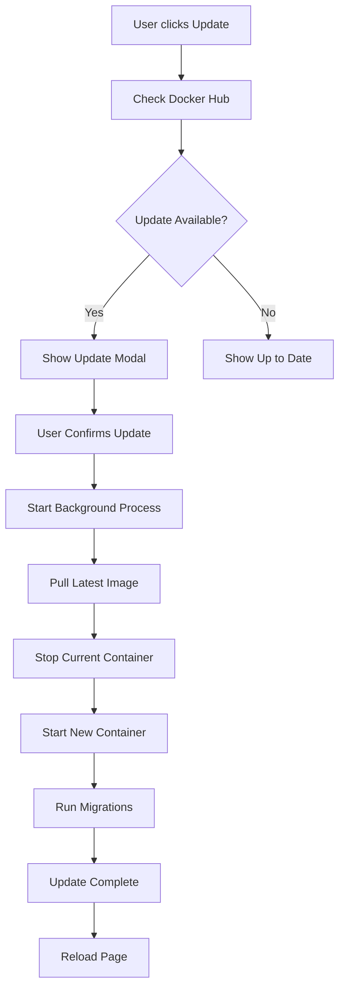

# Auto-Update Feature Documentation

Fitur auto-update memungkinkan aplikasi Internet Management untuk melakukan update otomatis dari Docker Hub tanpa perlu manual intervention.

## 🚀 Fitur Utama

### 1. **Update Notification**
- Badge notification di header admin panel
- Popup notifikasi ketika ada update tersedia
- Real-time status update progress

### 2. **One-Click Update**
- Tombol "Update Now" untuk memulai update
- Progress bar real-time
- Automatic restart setelah update selesai

### 3. **Version Management**
- Check versi terbaru dari Docker Hub
- Compare dengan versi saat ini
- Automatic version detection

## 📋 Komponen yang Dibuat

### 1. **API Endpoints**
- `GET /api/update/check` - Check update availability
- `POST /api/update/perform` - Start update process
- `GET /api/update/status` - Get update progress

### 2. **Update Controller**
- `app/Http/Controllers/UpdateController.php`
- Handle semua logic update
- Docker Hub API integration
- Background process management

### 3. **Update Notification Component**
- `resources/views/components/update-notification.blade.php`
- Real-time notification UI
- Progress tracking
- Modal dialogs

### 4. **Admin Layout**
- `resources/views/layouts/admin.blade.php`
- Integrated update notification
- Modern admin interface
- Responsive design

### 5. **Update Script**
- `scripts/update.sh`
- Docker container management
- Image pulling and deployment
- Database migration handling

## 🔧 Konfigurasi

### Environment Variables
```env
APP_VERSION=1.0.0
DOCKER_HUB_IMAGE=habis12/internet-management
```

### Docker Requirements
- Docker CLI installed in container
- Access to Docker Hub
- Proper permissions for container management

## 🚀 Cara Menggunakan

### 1. **Check Update**
- Login ke admin panel
- Klik tombol update di header
- System akan check versi terbaru

### 2. **Perform Update**
- Klik "Update Now" jika ada update
- Tunggu progress bar selesai
- Aplikasi akan restart otomatis

### 3. **Monitor Progress**
- Real-time progress tracking
- Status messages
- Error handling

## 📊 Update Process Flow



## 🔒 Security Features

### 1. **Authentication Required**
- Update endpoints protected by auth middleware
- Only authenticated users can trigger updates

### 2. **Docker Security**
- Container isolation
- Proper permission handling
- Safe container replacement

### 3. **Error Handling**
- Graceful failure handling
- Rollback capability
- Status tracking

## 📱 UI Components

### 1. **Update Badge**
- Red dot indicator when update available
- Click to check for updates
- Auto-refresh every 30 minutes

### 2. **Update Modal**
- Version comparison
- Update confirmation
- Progress tracking

### 3. **Progress Modal**
- Real-time progress bar
- Status messages
- Completion notification

## 🛠️ Technical Details

### 1. **Docker Hub Integration**
- REST API calls to Docker Hub
- Tag version comparison
- Image metadata retrieval

### 2. **Background Processing**
- Asynchronous update process
- Status file tracking
- Progress monitoring

### 3. **Container Management**
- Docker CLI integration
- Container lifecycle management
- Volume mounting preservation

## 🚨 Troubleshooting

### Common Issues

1. **Update Check Failed**
   - Check internet connection
   - Verify Docker Hub access
   - Check API rate limits

2. **Update Process Failed**
   - Check Docker permissions
   - Verify container status
   - Check logs for errors

3. **Container Won't Start**
   - Check environment variables
   - Verify port availability
   - Check resource limits

### Debug Commands

```bash
# Check update status
cat /var/www/html/storage/app/update_status.json

# Check container logs
docker logs internet-app

# Check Docker images
docker images habis12/internet-management

# Manual update
bash /var/www/html/scripts/update.sh
```

## 📈 Monitoring

### 1. **Update Logs**
- Status file tracking
- Progress monitoring
- Error logging

### 2. **Performance Metrics**
- Update duration
- Success rate
- Error frequency

### 3. **Health Checks**
- Container health
- Application status
- Database connectivity

## 🔄 Maintenance

### 1. **Regular Updates**
- Check for updates weekly
- Monitor Docker Hub for new releases
- Test updates in staging environment

### 2. **Cleanup**
- Remove old Docker images
- Clean up update logs
- Monitor disk space

### 3. **Backup**
- Backup before major updates
- Database backup
- Configuration backup

## 🎯 Best Practices

### 1. **Update Strategy**
- Test updates in staging first
- Schedule updates during maintenance windows
- Monitor application after updates

### 2. **Security**
- Keep Docker images updated
- Monitor for security vulnerabilities
- Use latest base images

### 3. **Performance**
- Monitor resource usage
- Optimize container size
- Use multi-stage builds

## 📞 Support

Jika mengalami masalah dengan fitur auto-update:

1. **Check Logs**: Lihat logs di admin panel
2. **Verify Configuration**: Pastikan environment variables benar
3. **Test Manually**: Jalankan update script manual
4. **Contact Support**: Hubungi tim support jika masalah persisten

## 🎉 Kesimpulan

Fitur auto-update memberikan kemudahan untuk:
- ✅ Update aplikasi tanpa downtime
- ✅ Monitoring versi terbaru
- ✅ One-click deployment
- ✅ Real-time progress tracking
- ✅ Automatic rollback capability

**Fitur ini membuat maintenance aplikasi menjadi lebih mudah dan efisien!**
